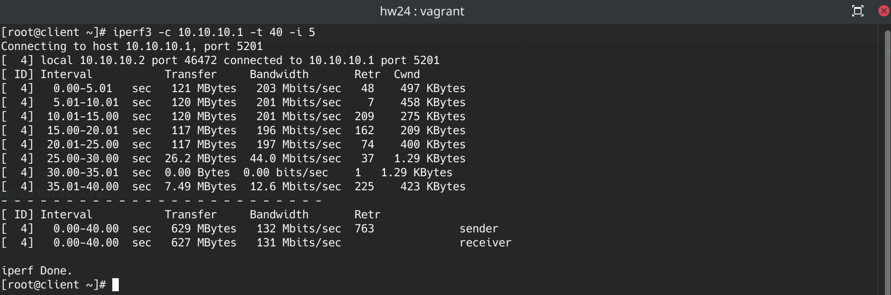
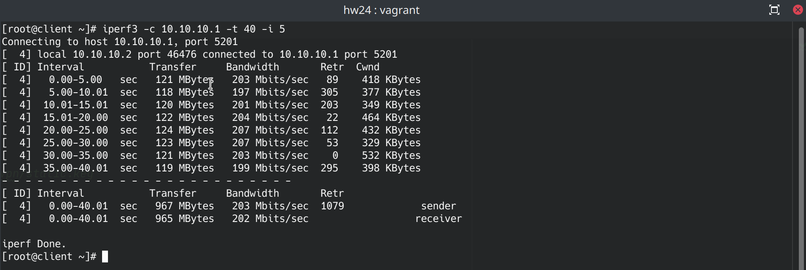
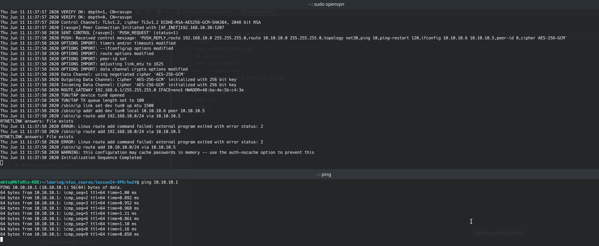
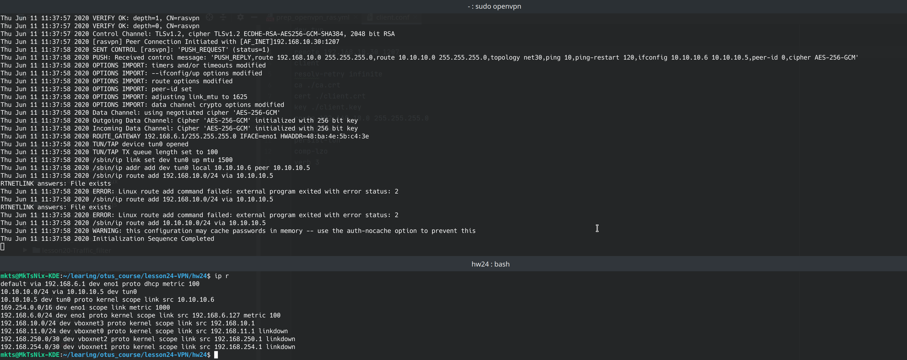

##### Разворачиваем стэнд
```bash
vagrunt up
```
##### 1. Между двумя виртуалками поднять vpn в режимах tun/tap:
Для настройки openvpn с tap интерфейсом запускам ansible сценарий prep_openvpn_tap.yml

``` bash
ansible-playbook playbooks/prep_openvpn_tap.yml
```
Вывод iperf3


Для настройки openvpn с tun интерфейсом запускам ansible сценарий prep_openvpn_tun.yml

``` bash
ansible-playbook playbooks/prep_openvpn_tun.yml
```

Вывод iperf3


TAP эмулирует Ethernet устройство и работает на канальном уровне модели OSI, оперируя кадрами Ethernet. TUN (сетевой туннель) работает на сетевом уровне модели OSI, оперируя IP пакетами. TAP используется для создания сетевого моста, тогда как TUN для маршрутизации.

##### 2. Поднять RAS на базе OpenVPN с клиентскими сертификатами, подключится с локальной машины на виртуалку

Переходим в папку с клиентским конфигом и ключами и запускаем openvpn клиент на локальном хосте
``` bash
cd ./templates/ras/templates/ras/client_pki/
sudo openvpn --config client.conf
```
Запускаем ping с локального хоста



Проверяем маршруты

